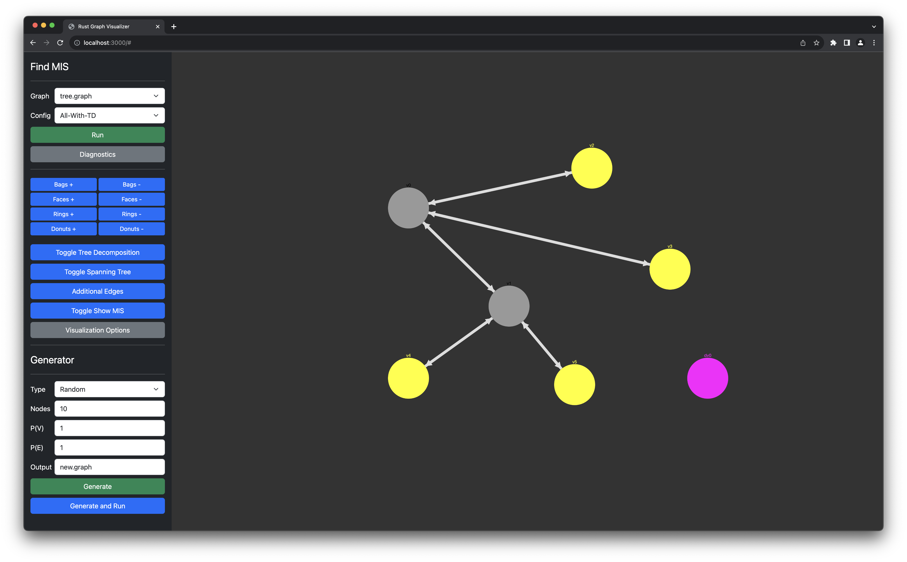

# thm-ptas
This repository is used for our GFSP SS23 Project 

## How to use?

View available falgs with:

```
cargo run -- --help
```

To execute the Program with a given example graph using the PTAS scheme with an approximation of `k=2`:

```
cargo run -- ptas --k 2 data/exp.graph 
```

To execute the Program with a given example graph using the exhaustive scheme:

```
cargo run -- exhaustive data/exp.graph 
```

## The input data


The input of this program is the planar embedding of a (planar) undirected graph.

The embedding should be provided as a text-file and follow this specification:


```
<Number of vertices>
<Number of edges>
<Source vertex> <Target vertex>
<Source vertex> <Target vertex>
<Source vertex> <Target vertex>
...
```

It is important, that the embedding contains both directions for each arc of the graph.
Also the arcs have to be in counterclockwise order for each source vertex.

If you want more information about this format or more graphs, you can find both [here](http://www.inf.udec.cl/~jfuentess/datasets/graphs.php).

### Generating Input Data

To generate random planar graphs and their embedding, you can use the python script located in this repository.
For example: 
```
 python3 ./generate.py --nodes 25 --rings 2 --nprob 0.8 --eprob 0.7 data/exp.graph --type random
```

## Web Visualizer
It is possible to use the Rust MIS solver and Generator script in tandem through a nice web interface.



### Installation
* Build the Rust executable with `cargo build --release`.
* Install the Flask Python package with `pip install Flask`

### Running
Run the `server.py` program in the `web` folder.

* `cd web; python3 ./server.py`
* Visit `http://localhost:3000/`

### Functions
* Running: find the MIS on a given graph using PTAS (approximation), Exhaustive (exact solution), "All-With-TD" (exact solution using tree decomposition)
* Navigation: After running navigate through the graph and examine the results.
  * Faces: navigate through faces
  * Bags: navigate through bags
  * Donuts: navigate through donuts
  * Rings: navigate through rings
  * Toggle Tree Decomposition: show and hide the graph's tree decomposition
  * Additional Edges: show triangulated edges
  * Toggle Show MIS: highlight the graph's vertices belong to the maximum independent set (marked yellow)
  * Visualization Options: tweak graph visualization
* Generator: generate new graphs randomly
  * Type: either Random or Circular
  * Rings: amount of rings when graph is circular
  * Nodes: amount of nodes
  * P(V): probability of a vertex being added
  * P(E): probability of an edge being added
  * Output: name of the graph file
